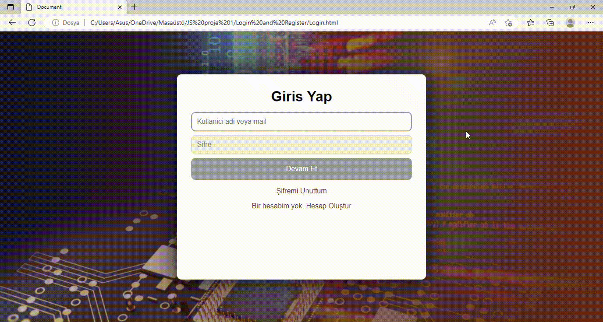

<h1>Login and Registration App</h1>

This is an apllication using to enter web site etc.

<h2>Which technologies were used? </h2>

I used HTML and CSS as I created these applications.
   Applications are working in a connection with each other. 
   So one who has an account can log in but if there isn't an account, 
   it can be reached the register app through the button.

<h2>View</h2>

